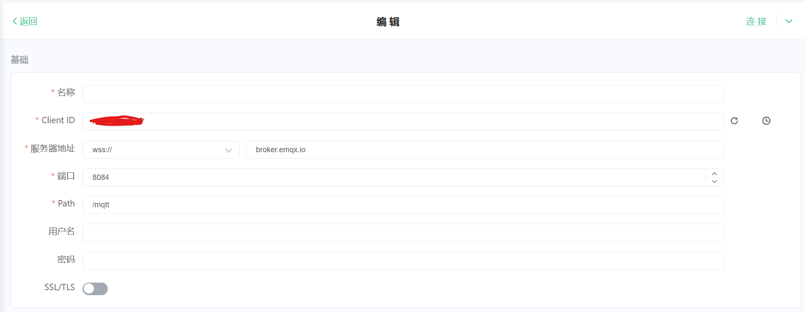
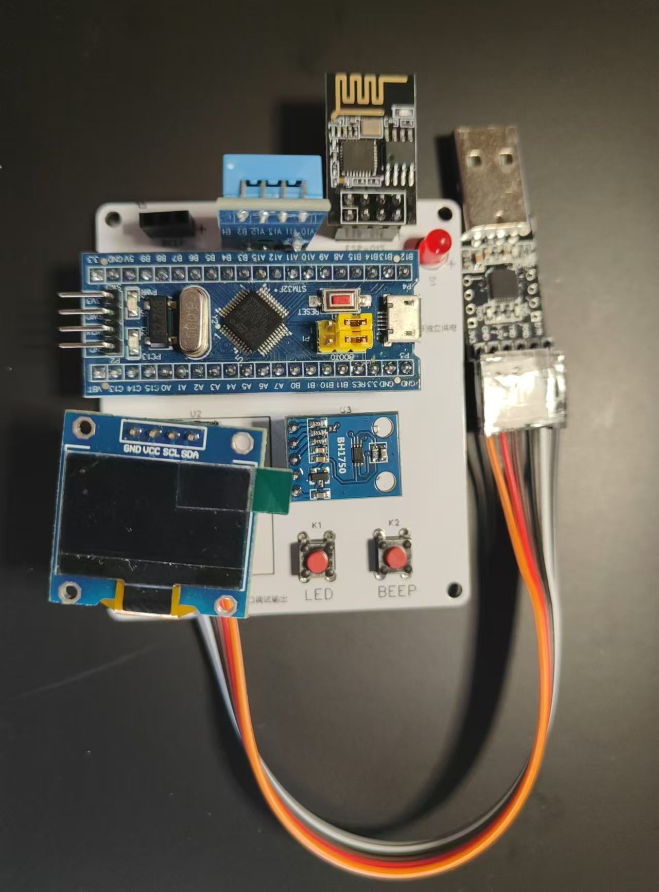
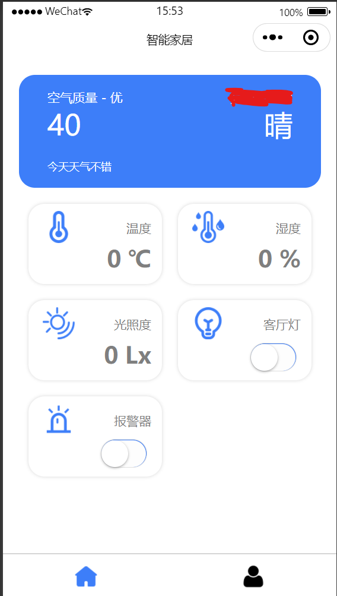

# 智能家居

#### 介绍
**这个是一个嵌入式的小项目**  
这个项目下位机使用*keil5.41*作为开发环境，上位机使用的是*微信开发者工具*作为开发环境，开发板的绘制使用的是*嘉立创EDA* 作为开发环境，使用的开发板是STM32F103C8T6,使用到的传感器有温湿度传感器，蜂鸣器，0.96寸的OLED屏幕，ESP8266-01S，BH750，USB-TTL，一个LED灯，两个按键开关。通信使用的是MQTT，使用官方提供的服务器。实现上位机对下位机的操控，下位机数据可以传输给上位机，

#### 配置
1.Mqtt配置后的设置大概是下面的样子  

2.安装之后的下位机大致样子（由于USB-TTL只有一个，没有买更合适的，所以可能比较丑）  

3.上位机微信小程序  

